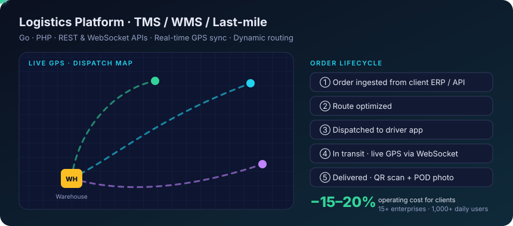
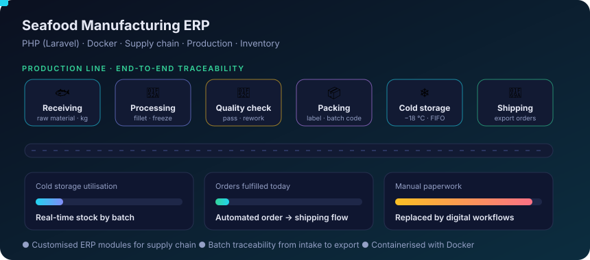

  

  
  
  

## 👋 About me

- 🛠️ Backend Engineer with **3.5+ years** building distributed, real-time systems in **Go** and **PHP**
- ⚡ Production experience with **Temporal, Kafka, NATS, ClickHouse, PostgreSQL** and WebSocket at scale
- 🤖 Integrate LLMs (OpenAI, Claude, Gemini) into products and ship faster with AI agents (Claude Code, Cursor)
- 🎯 Open to **Backend / Platform Engineer** roles

## 🧰 Tech stack

  
   
  

## 🚀 Featured projects

> Production systems built at previous companies. Code is private (NDA); the visuals show the architecture, not proprietary details.
> Click any diagram to open its **interactive demo**.

### 🎮 Gaming CRM · Real-time Workflow Platform

- Stateful workflow engine on **Temporal**: long-running CRM flows with automatic retry and recovery
- **WebSocket cluster** in Go serving tens of thousands of concurrent player connections
- Event pipelines on **NATS + Kafka**; analytics in **ClickHouse**, transactions in **PostgreSQL**

### 🚚 Logistics Platform · TMS / WMS / Last-mile

- Backend for driver, shipper and admin apps used by **15+ enterprises**
- Real-time GPS sync and dynamic routing that cut client operating costs by **15–20%**
- Barcode/QR scanning and proof-of-delivery uploads over REST and WebSocket

### 🎟️ Ticketing & Booking Platform

- Booking APIs with **Redis locks**, caching and message queues
- No double-booking and stable uptime through peak-season traffic

### 🐟 Seafood Manufacturing ERP

- Extended ERP modules in **Laravel** + Docker for intake, processing, QC, packing, cold storage and shipping
- Batch traceability and digital workflows replacing manual paperwork

## 📊 GitHub stats

  
  

